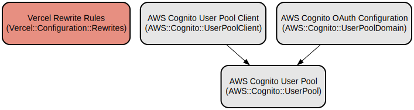

# Educational Management System - Modern React Dashboard for Academic Administration

A comprehensive React-based educational management dashboard that provides secure authentication through AWS Cognito and seamless integration with educational APIs. This system offers an intuitive interface for managing academic resources with real-time data synchronization and responsive design.

The application serves as a centralized platform for educational institution administrators to manage various aspects of their academic operations. It features a modern, responsive interface with dynamic entity management, real-time search capabilities, and secure user authentication. Built with React and AWS Amplify, it provides a robust foundation for educational resource management with features like custom cursor effects, modal dialogs, and comprehensive error handling.

## Repository Structure
```
final-front/
├── api/                      # API route handlers for backend communication
│   ├── [entity].js          # Dynamic API endpoint handler for entity operations
│   └── usuario.js           # User-specific API endpoint handler
├── src/
│   ├── components/          # Reusable React components
│   │   ├── AuthCheck.jsx    # Authentication verification component
│   │   ├── EntityList.jsx   # Entity listing component
│   │   └── Modal.jsx        # Modal dialog component
│   ├── hooks/               # Custom React hooks
│   │   └── useEntityData.js # Data management hook for entities
│   ├── pages/               # Page components
│   │   ├── Dashboard.jsx    # Main dashboard page
│   │   └── Login.jsx        # Login page
│   ├── services/            # API service layer
│   │   └── api.js          # API communication utilities
│   └── App.jsx             # Main application component
├── vercel.json             # Vercel deployment configuration
└── vite.config.js         # Vite build configuration
```

## Usage Instructions
### Prerequisites
- Node.js 14.x or higher
- npm 6.x or higher
- AWS account with Cognito user pool configured
- Modern web browser with JavaScript enabled

### Installation
```bash
# Clone the repository
git clone <repository-url>
cd final-front

# Install dependencies
npm install

# Configure environment variables
cp .env.example .env
# Edit .env with your AWS Cognito credentials
```

### Quick Start
1. Start the development server:
```bash
npm run dev
```

2. Access the application:
- Development: http://localhost:5173
- Production: https://front-final-app-ser.vercel.app

3. Log in using your AWS Cognito credentials

### More Detailed Examples
```javascript
// Example: Using the EntityData hook
import { useEntityData } from '../hooks/useEntityData';

const MyComponent = () => {
  const { 
    entityData, 
    isLoading, 
    error, 
    loadEntityData 
  } = useEntityData();

  useEffect(() => {
    loadEntityData('users');
  }, []);

  return isLoading ? <div>Loading...</div> : <div>{/* render data */}</div>;
};
```

### Troubleshooting
1. Authentication Issues
- Error: "User not authenticated"
  - Verify AWS Cognito configuration in amplifyconfiguration.json
  - Check browser console for specific error messages
  - Ensure redirect URLs are properly configured in AWS Cognito

2. API Connection Issues
- Error: "Failed to fetch data"
  - Verify API endpoint configuration in vercel.json
  - Check network tab for specific HTTP errors
  - Ensure CORS settings are properly configured

3. Build Issues
- Error: "Module not found"
  - Run `npm install` to ensure all dependencies are installed
  - Clear npm cache: `npm cache clean --force`
  - Delete node_modules and package-lock.json and reinstall

## Data Flow
The application follows a unidirectional data flow pattern with AWS Cognito authentication and REST API integration.

```ascii
[User] -> [AWS Cognito] -> [React App]
                              |
                        [Entity Management]
                              |
                     [REST API Integration]
                              |
[Database] <-------- [Backend API Server]
```

Key Component Interactions:
1. User authentication flows through AWS Cognito
2. AuthCheck component verifies user session on protected routes
3. Dashboard component manages entity selection and data operations
4. EntityData hook handles CRUD operations through API service
5. Modal component manages create/edit/delete operations
6. API proxy handles backend communication with error handling

## Infrastructure


AWS Resources:
- Cognito User Pool:
  - Region: us-east-2
  - Pool ID: us-east-2_ESEqaFAWv
  - Client ID: 5m7gdct47o15mmvub406p8lvhc

Vercel Configuration:
- API Proxy:
  - Source: /api/:path*
  - Destination: http://apifinalsw2025.tryasp.net/api/:path*
- SPA Routing:
  - All non-API routes redirect to index.html

## Deployment
1. Prerequisites:
- Vercel CLI installed
- AWS Cognito pool configured
- API endpoints accessible

2. Deployment Steps:
```bash
# Build the application
npm run build

# Deploy to Vercel
vercel --prod
```

3. Environment Configuration:
- Configure environment variables in Vercel dashboard
- Update AWS Cognito redirect URLs
- Verify API proxy settings in vercel.json